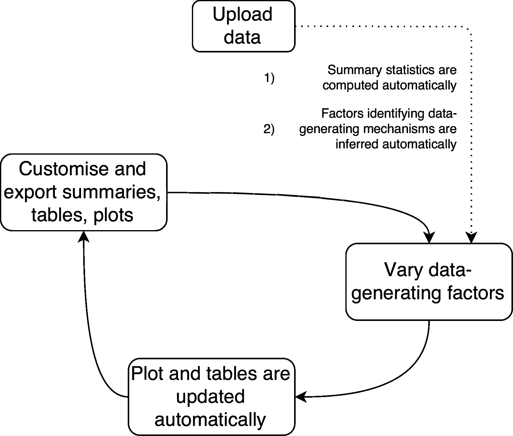

<!-- README.md is generated from README.Rmd. Please edit that file -->

# INTEREST 

INTEREST, acronym for **IN**teractive **T**ool for **E**xploring
**RE**sults from **S**imulation s**T**udies, is an interactive web app
developed using R and [`shiny`](https://shiny.rstudio.com/). It allows
exploring results from simulation studies interactively.

[](https://ci.appveyor.com/project/ellessenne/interest)
[](https://travis-ci.org/ellessenne/interest)
[](https://cran.r-project.org/package=interest)

# Live demo

A live demo of INTEREST can be found
[here](https://interest.shinyapps.io/interest/). Please note that this
version is still under active development: bug reports and feature
requests are welcome.

# Installation

INTEREST can be installed locally as a standalone R package, by typing
the following R commands in your R console:

``` r
# install.packages("devtools")
devtools::install_github("ellessenne/interest")
```

This requires a working installation of [R](https://www.r-project.org/)
and, preferably, [RStudio](https://www.rstudio.com/).

# Launch application

To launch INTEREST first load the `interest` R package:

``` r
library(interest)
```

Then, use the `interest()` function:

``` r
interest()
```

The app should now launch in your browser.

# Workflow



The workflow of INTERACT is simple:

1.  Load your data and define variables representing point estimates,
    standard errors, methods, and so on;
2.  Performance measures are estimated automatically;
3.  Tables and plots are produced automatically, and can be customised
    and explored interactively;
4.  Tables and plots can be exported for later use.

# Additional material on INTEREST

  - Slides on [`rsimsum`](https://ellessenne.github.io/rsimsum/) and
    INTEREST presented at the 2019 useR\! conference
    [\[here\]](https://github.com/ellessenne/rsimsum/blob/master/inst/Talks/ag-useR-2019.pdf)

  - Slides to present SiReX (former name of INTEREST) at the Students’
    Day, 38<sup>th</sup> Annual Conference of the International Society
    for Clinical Biostatistics
    [\[here\]](README_files/iscb38_slides.pdf)

  - Poster at the 2017 Annual Conference of the Department of Health
    Sciences, University of Leicester
    [\[here\]](README_files/hs_poster.pdf)
