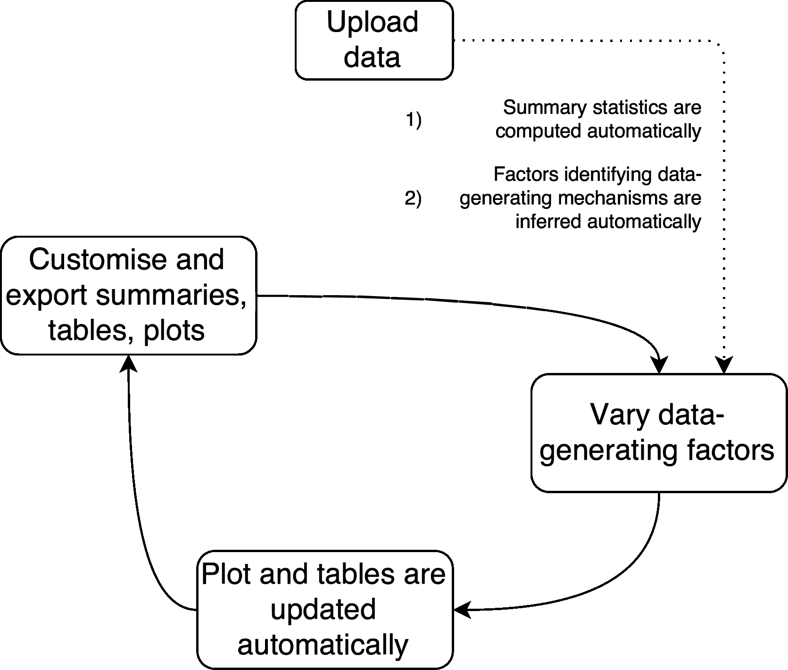

<!-- README.md is generated from README.Rmd. Please edit that file -->
```{r, echo = FALSE}
knitr::opts_chunk$set(collapse = TRUE, comment = "##", fig.retina = 2, fig.path = "README_figs/")
```

POUSSIN, acronym for _Probe OUtput of Simulation Study INteractively_, is an interactive web app developed using R and [`shiny`](https://shiny.rstudio.com/). It allows exploring results from simulation studies interactively.


# Installation

# Launch application

# Workflow


